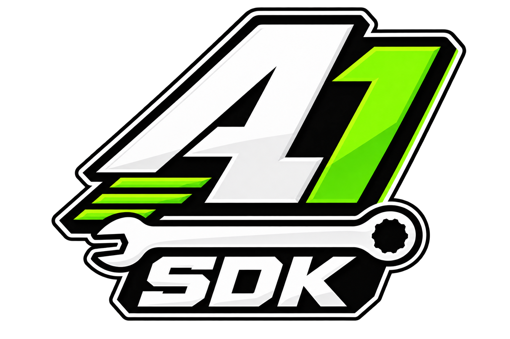

  

# ALLIN1 SDK

Create, inspect and package **GTA V Story Mode** mods for **Legacy and Enhanced**.
Standalone: no ALLIN1 Launcher or gameplay client required.

**0.6.4 — unsigned prerelease.** The interface is React/Tauri v2; Tkinter source
and GUI build targets are removed. Python services remain. Final native/live
acceptance is untested; this is not a release-qualified stable build.

## What's new in 0.6.4

- Expanded vehicle, weapon, ped and map authoring.
- RPF editing, package building and reviewed recovery.
- Native previews, optional Blender rendering and standalone assistant setup.
- Lighter initial loading, preserved drafts and stronger package validation.

[0.6.4 release notes](RELEASE_NOTES.md) · [Earlier releases](docs/archive/release-notes-before-0.6.4.md)

## Downloads

[Published builds](https://github.com/MinionEnjoyer/ALLIN1-SDK/releases) are on GitHub.
0.6.4 prereleases are **unsigned manual downloads**, without a promised SignPath
certificate. Verify checksums and build identity; automatic-update installation
remains disabled. Read the [download and trust policy](CODE_SIGNING_POLICY.md).

## Documentation

- [SDK manual](docs/sdk-guide.md) — workspaces and authoring.
- [Source setup](desktop/README.md) — development and building.
- [Release checklist](docs/release-0.6.4.md) — remaining work and validation.
- [Documentation index](docs/README.md) — CLI, contracts and detailed guides.

[Support the project](https://buymeacoffee.com/minionenjoyer) · [License](LICENSE)
